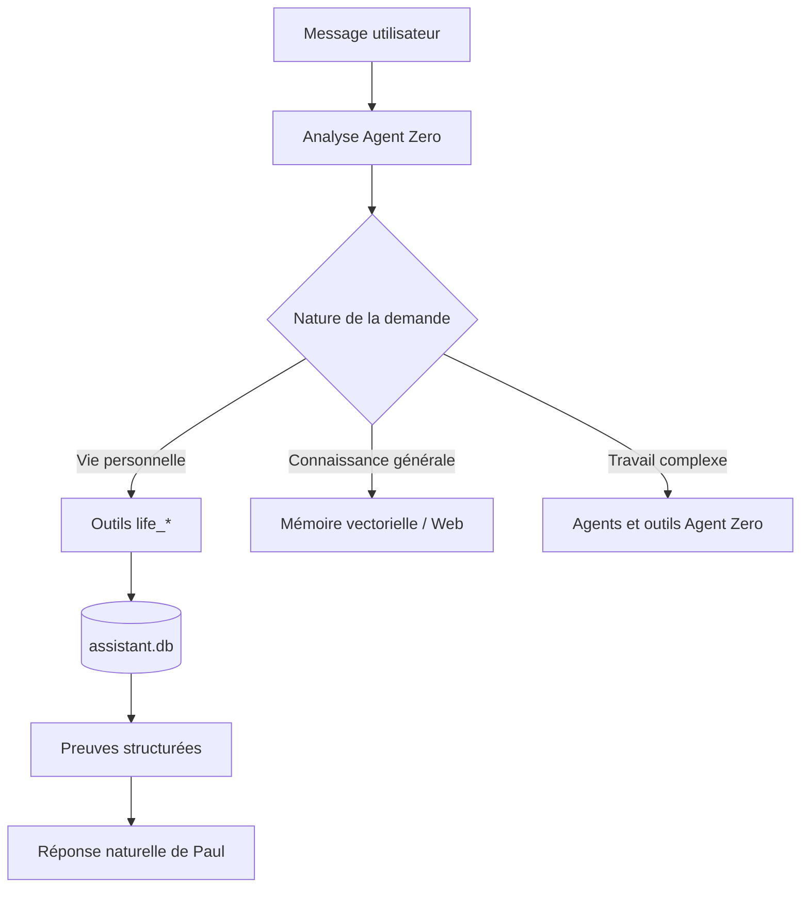

# Architecture mémoire V11

## Répartition des responsabilités

| Domaine | Source de vérité |
| --- | --- |
| Tâches et leur état | `records`, type `task`, `task_bucket=daily|backlog` |
| Rendez-vous | `records`, type `appointment` |
| Événements personnels | `records`, type `event` |
| Déclarations et détails originaux | `record_observations` |
| Actions accomplies | `record_observations`, type `action|completion` |
| Humeurs et ressentis | `records`, type `mood` |
| Faits, préférences, relations | `facts`, avec versions |
| Personnes, lieux, projets | `entities` et `record_entities` |
| Corrections et suppressions | `record_history`, journal append-only |
| Relances de conversation | `conversation_state`, isolé par chat Agent Zero |
| Connaissances générales | mémoire vectorielle native d'Agent Zero |

## Règles invariantes

1. Le texte de Paul n'est jamais mémorisé comme un fait utilisateur.
2. Un fait actuel contradictoire clôt l'ancienne version ; il ne crée pas deux
   vérités actives.
3. Répéter le même fait renforce son compteur d'occurrences.
4. Chaque déclaration utilisateur conserve une observation séparée, même si la
   ligne logique est renforcée ou réutilisée.
5. Terminer une tâche met à jour la tâche existante et ajoute une observation de
   réalisation ; elle peut donc être comptée sans créer une fausse deuxième
   tâche.
6. Seules les tâches explicitement datées et en retard peuvent être reportées.
7. Un rendez-vous ou un événement n'est jamais reporté automatiquement.
8. Toute écriture conserve le texte source, la confiance et une trace d'audit.
9. Une relance réutilise les filtres du dernier résultat du même chat, pas ceux
   d'une autre conversation.
10. Une recherche personnelle vide reste locale et signale l'absence de donnée.
11. Les inférences sont marquées et ne remplacent jamais un fait explicite.
12. Une tâche en retard passe au backlog général et conserve sa date d'origine,
    son nombre de reports et son audit.

## Flux de décision

Le modèle comprend la phrase et choisit l'action. La base valide ensuite les
types, dates, statuts et transitions avant d'écrire quoi que ce soit.
